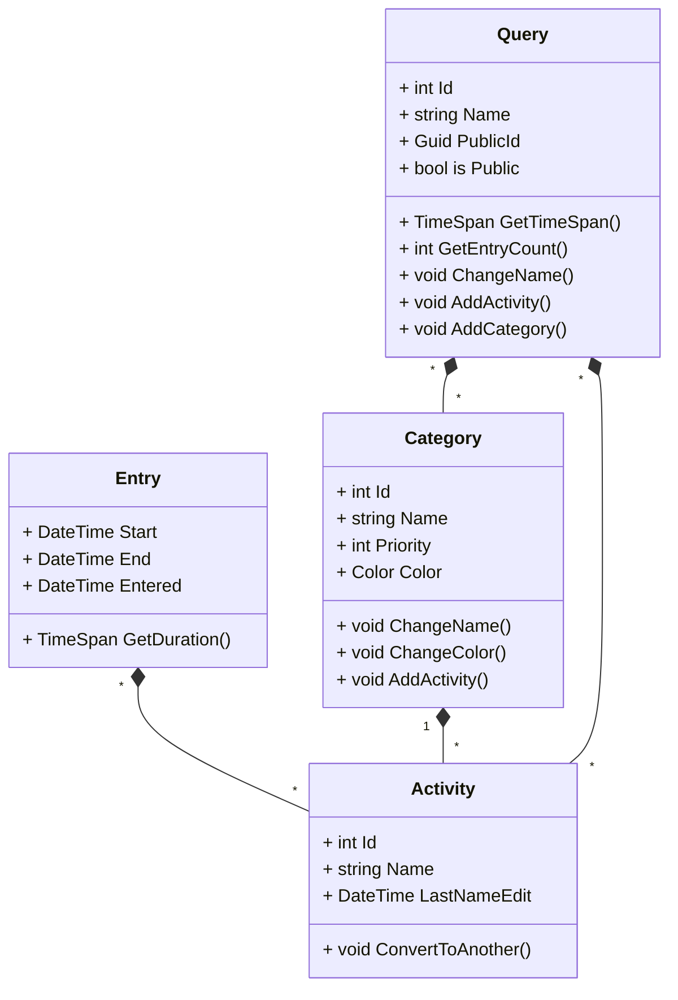
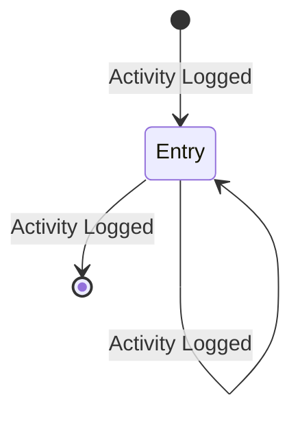
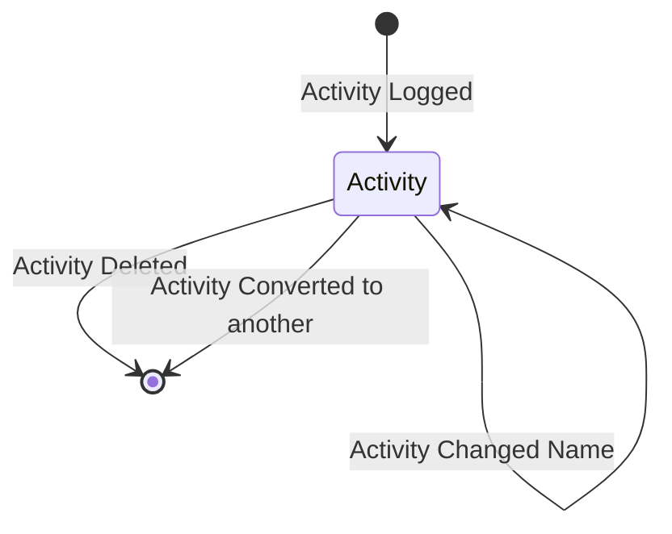
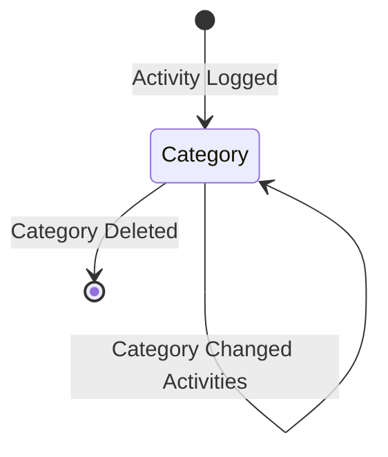
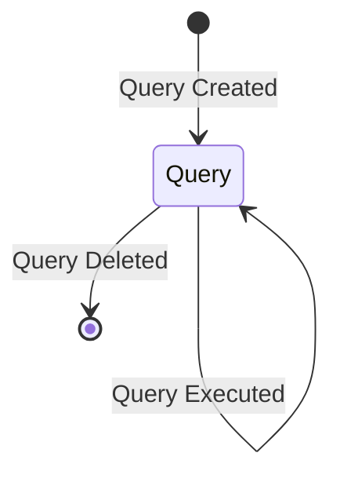

# Problem Domain Analysis
## System Definition 
The system is an Activity tracking and analysis tool that allows users to log and categorize their Activities. The system provides an easy and intuitive interface for starting and ending Activities, such as Running, Attending University, or Taking the Train, as well as categorizing them for analysis and visualization. The system is capable of tracking all 24 hours of the day, allowing the user to log and analyze their Activities at any time. The system presents the user’s Activities in a clear and organized manner, allowing the user to analyze their time usage and gain insights into their behavior.

## FACTOR
### Functionality
- The user can start and stop Activities at any time. Including in the past, the pressent and the future
- Activities can be 
  - Categorized
  - Visualized using different colors, which is user defined
  - Migrate/convert to other activites, e.g. converting `diner` to `dinner` 
- Possible to query all Activities for metrics like 
  - Hours spent doing the Activity
  - Number of times the Activity has been logged
### Application Domain
The primary user will be the developer of the system.
However, it should also be possible for other users to use the system without much guidance.
### Conditions
Developed mostly by a single developer in his freetime, but with help from friends.
### Technology
- VPS, for hosting with limited resources 
- Web base UI for access anywhere
### Objects
See the section `Problem Domain/Classes`
### Responsibilities 
It must make sure that all Activities which are recorded are safely stored and always avaliable for the user. 
Furthermore it must give correct numbers with regard to how much time and how many times an Activity has been logged.

# Problem Domain
## Classes
- Entry
  - Contains time information and what Activity is started
  - E.g. At 10:15 I was on call with the doctor, while out walking
- Activity
  - Is a label used to uniquely identify an Activity 
  - E.g. Calling the doctor or walking 
- Category
  - Is a collection of Activities
  - It is used to color the Activity, e.g. sports are green and watching Netflix might be orange
  - E.g. Sports might include Activities like: running, dancing, or swimmingd
- Query 
  - A selection of Activities and Categories that are interesting 
  - Used to query the database for interesting findings 
  - Example Queries
	  - How many hours have I spent dancing the last year? 
	  - Do I exercise at least 10 hours a week?
	  - How often do I call my parents?
	  - How much time have I spent calling my parents?
  - Input for a query could be a date range e.g. this year, or something even more complex like every evening this month
  - Maybe Queries can also reference quereies? (This could result in dependency cycles)
- User
  - Unique identifier used to seperate different users information
  - It is not modeled as it is just part of every object, and would cludder the analysis 

## Events 
- Activity 
  - Logged
    - It start a new Entry and ends another 
  - Deleted
    - Only possible if no entries reference this Activity 
  - Converted to a new Activity
- Category
  - Created
  - Changed Name
  - Changed Color
  - Changed Priority
  - Changed Activates
  - Deleted
- Query
  - Created
  - Changed Name
  - Changed Activities  
  - Changed Categories 
  - Changed to Pulbic 
  - Executed 
  - Deleted

## Event Table
| Event \ Object                         | Entry | Activity | Category | Query |
| --------------                         | :-:   | :-:      | :-:      | :-:   |
| Activity Logged                        | +     | *        |          |       |
| Activity Deleted by User               |       | +        | *        | *     |
| Activity Converted to a new Activity   |       | *        | *        | *     |
| Category Created                       |       |          | +        |       |
| Category Changed Name                  |       |          | *        |       |
| Category Changed Color                 |       |          | *        |       |
| Category Changed Priority              |       |          | *        |       |
| Category Changed Activates             |       |          | *        | *     |
| Category Deleted                       |       |          | +        | *     |
| Query Created                          |       |          |          | +     |
| Query Changed Name                     |       |          |          | *     |
| Query Changed Activities               |       |          |          | *     |
| Query Changed Categories               |       |          |          | *     |
| Query Changed to Pulbic                |       |          |          | *     |
| Query Executed                         |       |          |          | *     |
| Query Deleted                          |       |          |          | +     |

## Class Diagram

## State Chart Diagrams
### Entry
An Entry is created when an Activity is logged on a TimeStamp where no Entry is associated.
It is changed when another Activiyt is logged on the same TimeStamp
It is deleted if en "empty" Activity is logged on the same TimeStamp 

### Activity
An Activity is created when an unknown Activity is logged.
It can be deleted by the user iff there are no entries that refernce it, or if it is converted to another Activity.

### Category
A Category is created when an Activity is logged with an unknown Category, or when a user creates one.
It can be deleted by the user iff there are no Activities that refernce it.

### Query
A Query is created when a user creates one.
It can be deleted by the user at any point in time.

